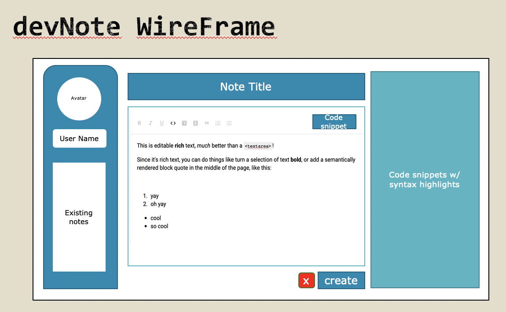
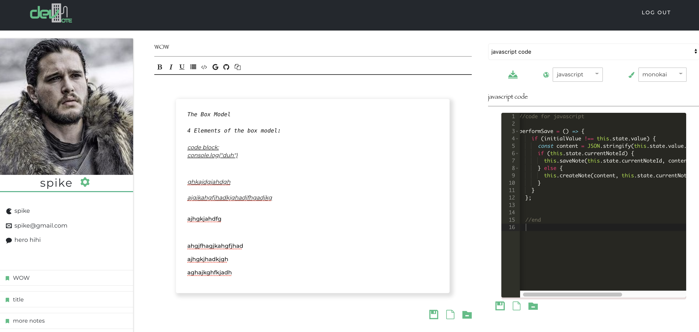

  

  
  <a href="">
    

## Introduction

You know 

 - Most note-taking apps aren’t designed with programmers in mind
 - they can be so difficult to use that they drive you to give up on notes entirely.
 - Taking notes should not be difficult and time consuming. Should be
   easy and simple

Visit [my-devnote.herokuapp.com]([https://my-devnote.herokuapp.com/](https://my-devnote.herokuapp.com/)) or watch [this demo](https://youtu.be/2wYDOWPsMhw) to learn more about the project.

## Features

-  **Authentications For Users**. Simply create an account with password to log in.
- **Create, Update, Delete Notes with Rich Text Editor**. Simply create an account and log into our landing page
- **Auto Saving**. Auto saving, currently set to auto save after 5 seconds stop typing on editors.
- **Code Snippet Syntax highlights with Coding Languages**. Customize your coding languages and themes on your coding snippet sandbox.
- **Exporting Notes and Codes**. download your codes and notes with one click

## WireFrame

WireFrame

## Example

Main Note & Code taking page after sign in.

## Usage

#### Note Taking with Rich Text Editor

There are a few highlights of taking notes with devNote text editor:
- Users can read, create, edit, delete notes and code snippets according to their needs.
- Auto saving feature trigger at every 5 seconds after user finish typing.
- Rich text editibility and custom buttons that open to GitHub and Google pages.

#### Customization of Code Snippets

After you've typed your block of codes in code snippets, you can customize your image by changing the syntax for that languages, theme color.

#### Export/Sharing

After you've customized your notes and code snippets,you can click on download button to export either just the block of code out as text file or you can add the notes along with the code snippets by clicking the copy button and share it else where.

##### Technologies

-  [`JWT Auth`](https://jwt.io/) - JSON web token 

-  [`React`](https://reactjs.org/) - Front End 

-  [`Ruby on Rails`](https://rubyonrails.org/) - Backend

-  [`Custom Css Styling`](https://developer.mozilla.org/en-US/docs/Web/CSS) 

##### Plugins

- [`react-toastify`]("https://www.npmjs.com/package/react-toastify/v/1.4.3") 
- [ `react-icons-kit`](https://www.npmjs.com/package/react-icons-kit) 
- [`react-dropdown`](https://www.npmjs.com/package/react-dropdown)

##### Libraries
- `slate`]([https://github.com/ianstormtaylor/slate](https://github.com/ianstormtaylor/slate)) - A completely customizable framework for building rich text editors.
- `react-ace`](https://github.com/securingsincity/react-ace) - React Ace Component for Syntax highlights

## FeedBack
Creating issues on Github are welcome. Also please leave feedback emails for design suggestions and more!

## Thanks To

[ HEROKU ](https://www.heroku.com) for free hosting.

## Authors

devNote is a project by <a href="https://victoriamei.com">Victoria Mei - VickysDailyStandup</a>

- Social Media ([@DailyVickys](https://www.instagram.com/vickysdailystandup/), [@vickysdailystandup]([@DailyVickys](hhttps://twitter.com/DailyVickys)))

